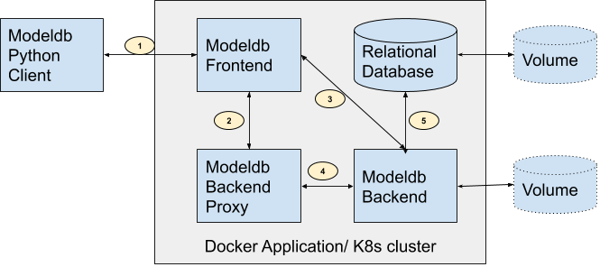

# ModelDB: A system to track, version and audit Machine Learning models

----

ModelDB is an end-to-end system for tracking, versioning and auditing  machine learning models. It ingests models and associated metadata as models are being trained, stores model data in a structured format, and surfaces it through a web-frontend for rich querying and the python client.

This version of ModelDB is built upon its [predecessor](https://mitdbg.github.io/modeldb/) from [CSAIL, MIT](https://www.csail.mit.edu/). The previous version can be found on Github [here](https://github.com/mitdbg/modeldb).

----

## Architecture

At a high level the architecture of ModelDB in a Kubernetes cluster or a Docker application looks as below:



- **ModelDB Client** developed in Python which can instantiated in the user's model building code and exposes functions to log related information to ModelDB.
- **ModelDB Frontend**  developed in JavaScript and typescript is the visual reporting module of ModelDB. It also acts as an entry point for the ModelDB cluster.
  - It receives the request from client (1) and the browser and route them to the appropriate container.
  - The gRPC calls (2) for creating, reading,updating or deleting Projects, Experiments, ExperimentRuns, Dataset, DatasetVersions or their metadata are routed to ModelDB Proxy.
  - The HTTP calls (3) for storing and retrieving binary artifacts are forwarded directly to backend.
- **ModelDB Backend Proxy** developed in golang is a light weight gRPC to Http convertor.
  - It receives the gRPC request from the front end (2) and sends them to backend (4). In the other direction it converts the response from backend and sends it to the frontend.
- **ModelDB Backend** developed in java is module which stores, retrieves or deletes information as triggered by user via the client or the front end.
  - It exposes gRPC endpoints (4) for most of the operations which is used by the proxy.
  - It has http endpoints (3) for storing, retrieving and deleting artifacts used directly by the frontend.
- **Database** ModelDB Backend stores (5) the information from the requests it receive into a Relational database.
  - Out of the box ModelDB is configured and verified to work against PostgreSQL, but since it uses Hibernate as a ORM and liquibase for change management, it should be easy to configure ModelDB to run on another SQL Database supported by the the tools.

*Volumes : The relational database and the artifact store in backend need volumes attached to enable persistent storage.*

----

## Setup and Installation

There are multiple way to bring up ModelDB.

### Docker Setup

#### Deploy pre published images

If you have [Docker Compose](https://docs.docker.com/compose/install/) installed, you can bring up a ModelDB server with just a single command.

```bash
docker-compose -f docker-compose-all.yaml up
```

This command will fetch the published images from Docker hub and setup the multi container environment. The webapp can be accessed at **<http://localhost:3000>**.

Logs will have an entry similar to `Backend server started listening on 8085` to indicate backend is up. During the first run backend will have to run the liquibase scripts so it will take a few extra minutes to come up. The progress can be monitored in the logs.

*Once the command finishes it might take a couple of minutes for the proxy, backend and frontend to establish connection. During this time any access through frontend or client may result in 502.*

#### Build images from source and deploy

To build the images you need Docker and jdk(1.8) installed. Each of the modules has a script to build its Docker image. This flow can be triggered by running from the root of the repository

```bash
./build_all_no_deploy_modeldb.sh
```

This will build the Docker images locally.

To use these images run steps in [Deploy pre published images](#deploy-pre-published-images), but this time since there will be locally built images , those will be used instead of pulling the images from remote repository.

A utility script to combine the two steps is available and can be run as

```bash
./build_modeldb.sh
```

### Kubernetes SetUp

Helm chart is available at `chart/modeldb`. ModelDB can be brought up on a Kubernetes cluster by running:

```bash
cd chart/modeldb
helm install . --name <release-name> --namespace <k8s namespace>
```

By default, the `default` namespace on your Kubernetes cluster is used. `release-name` is a arbitrary identifier user picks to perform future helm operations on the cluster.

To bring a cluster down, run:

```bash
helm del --purge <release-name-used-install-cmd>
```

----

## Repo Structure

Each module in the architecture diagram has a designated folder in this repository, and has their own README covering in depth documentation and contribution guidelines.

1. **protos** has the protobuf definitions of the objects and endpoint used across ModelDB. More details [here](protos/README.md).
1. **backend** has the source code and tests for ModelDB Backend. It also holds the proxy at **backend/proxy**. More details [here](backend/README.md).
1. **client** has the source code and tests for ModelDB client. More details [here](client/README.md).
1. **webapp** has the source and tests for ModelDB frontend. More details [here](webapp/README.md).

Other supporting material for deployment and documentation is at:

1. **chart** has the helm chart to deploy ModelDB onto your Kubernetes cluster. More details [here](chart/modeldb-oss/README.md).  
1. **doc-resources** has images for documentation.
